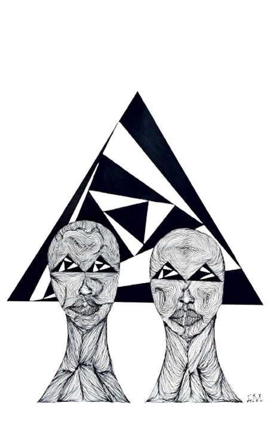

# 👋 Olá, eu sou Lucas M. Cunha

<table>
  <tr>
    <td width="70%" valign="top">
      <h3>👋 Sobre mim</h3>
      <ul>
        <li>🖌️ <strong>Artista Visual</strong> autodidata e não concluinte pelo <strong>IFPE – Campus Olinda</strong></li>
        <li>👨‍💻 Graduando em <strong>Análise e Desenvolvimento de Sistemas</strong> – Senac PE (2º período)</li>
        <li>💻 Foco em <strong>Front-End</strong> e criações interativas com <code>código</code>, <code>imagem</code> e <code>som</code></li>
        <li>👨‍🍳 <strong>Cozinheiro Profissional</strong> – 1430h pelo Senac (spoiler: mando bem na cozinha 😄)</li>
        <li>✨ Curioso por <strong>projetos experimentais</strong>, interfaces criativas e tecnologias que conectam pessoas</li>
      </ul>
    </td>
    <td width="30%" align="center" style="border-left: 1px solid #ddd; padding-left: 15px;">
      <br/>
      <sub><em>Lucas M. Cunha</em></sub>
    </td>
  </tr>
</table>


---

## 🚀 Sobre mim

Sou um criador por natureza. Misturo arte e tecnologia para explorar experiências que fogem do óbvio.  
Minha vivência periférica e dissidente alimenta meu olhar e meu código — arte como ferramenta de expressão, ruptura e conexão.

> “Produzo arte quando posso subverter.”

---

## 🛠️ Habilidades em prática

**Linguagens e tecnologias**  
JavaScript | HTML | CSS | Python | Ruby | SQL (MySQL)

**Ferramentas e plataformas**  
Git & GitHub | Figma | Miro | Docker | Bootstrap  
Sonic Pi (sim! faço live coding de som) 🎶

---

## 🧪 Explorando...

✨ Algorítmica sonora e visual  
🎛️ Live coding com Sonic Pi  
🌀 Ilusões de óptica interativas com p5.js  
🎨 Ilustração & animação  
📦 Modelagem 3D (iniciando!)

---

## 📚 Interesses

🧠 Arte generativa, computação criativa  
🚀 Ficção científica (sou fã dos clássicos cyberpunk)  
🎮 FPS e RPG de ação  

**Livros favoritos (ou quase lidos 😂):**  
- _Stranger in a Strange Land_  
- _Neuromancer_  
- _Count Zero_  
- _Mona Lisa Overdrive_

---

## 🤝 Conecte-se comigo

📫 **Email:** lumaoldc5@gmail.com  
🔗 **LinkedIn:** [lucas-m-cunha](https://www.linkedin.com/in/lucas-m-cunha-9063a0322/)

---

## 🧬 Alguns Personagens do meu universo

<div align="center">

---

<br/>

  

<h3 align="center">♾️ Dualidade — Fragmentos em Oposição</h3>  

<p align="center">  
  "Dualidade" é o retrato de um conflito silencioso e constante entre duas forças internas que habitam um só corpo.<br/>  
  De um lado, a lógica que busca ordem, algoritmos limpos, padrões previsíveis.  
  Do outro, o caos criativo — um impulso bruto que vê o código como tinta, cada bug como expressão.<br/>  
  Ambos os lados não se anulam, mas coexistem em tensão produtiva.  
</p>  

<p align="center">  
  <strong>Conexão com o Código:</strong> <em>Codificar é lidar com sombras</em><br/>  
  Enquanto o programador busca clareza, o artista em seu interior insere ruídos, distorções, desvios intencionais.<br/>  
  "Dualidade" é sobre transformar esse conflito em potência — onde o erro vira linguagem, e o debug, revelação.  
</p>  

---


<h3 align="center">🧿 Abba.exe — Guardião do Eixo Selvagem</h3>

<p align="center">
Abba é uma entidade ancestral incorporada ao código.<br/>
Ele habita o eixo entre o espiritual e o digital, protegendo fluxos,<br/>
purificando sistemas e transformando algoritmos em rituais vivos.
</p>

<p align="center">
<strong>Superpoder:</strong> <em>Codificação Vivo-Ritualística</em><br/>
Transforma funções em encantamentos e dados em sabedoria.<br/>
Cada linha escrita com alma ganha memória, intenção e presença.
</p>

```js
if (conexaoComAncestress()) {
  purificar(codigo);
}

